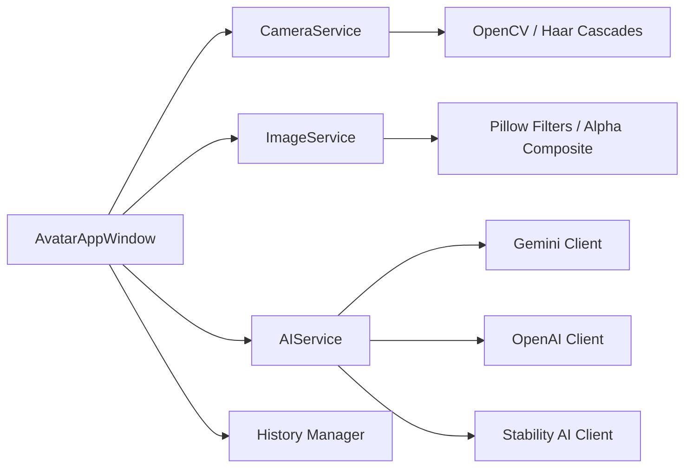

# Requirements

### Overview & Goals
The goal is to expand the existing AI Avatar Generator with advanced features proposed in the previous phase. This includes automated image processing (face detection), artistic enhancements, improved user experience (history/gallery), and broader AI integration.

### Scope
#### In Scope
- **Face Detection**: Automatic detection and cropping of faces.
- **Advanced Filters**: Sketch, Sepia, and Blur effects.
- **State Management**: Undo/Redo functionality.
- **Gallery**: Visual history of captured/edited images.
- **Stickers/Overlays**: Support for adding external image assets (glasses, hats) onto the avatar.
- **Multi-AI Support**: Integration of OpenAI and Stability AI clients.

#### Out of Scope
- Training custom AI models.
- Real-time video filters (filters will be applied to static captures for performance).
- Cloud storage for the gallery (local session only).

# Technical Design

### Current Implementation
- **UI**: Basic Tkinter window with camera preview and a few buttons.
- **Services**: `CameraService` (OpenCV), `ImageService` (Pillow), `AIService` (Gemini).
- **AI**: Simple prompt-based interaction with Gemini.

### Proposed Changes

#### 1. Face Detection & Processing
- **Service**: Add a `FaceService` or extend `CameraService` to use OpenCV's Haar Cascades.
- **Logic**: Identify the largest face in the frame and calculate a square bounding box for cropping.

#### 2. History & Gallery
- **State**: The `AvatarAppWindow` will maintain a `history` list (stack) of `PIL.Image` objects.
- **UI**: A new horizontal scrollable area at the bottom of the window using `tk.Canvas` and `tk.Frame`.

#### 3. Accessories System
- **Folder**: `assets/stickers/` will be the source of transparent PNGs.
- **Overlay**: `Image.alpha_composite` will be used to place stickers on the main image.

#### 4. Expanded AI Clients
- **AIService**: Introduce a factory pattern or registry for `BaseAIClient` implementations.
- **Providers**: Add `OpenAIClient` (DALL-E/GPT-4o-mini) and `StabilityAIClient`.

### Architecture Diagram

### File Structure
- `src/services/camera_service.py`: Add face detection logic.
- `src/services/image_service.py`: Add filter methods and sticker overlay logic.
- `src/services/ai_service.py`: Add `OpenAIClient` and `StabilityAIClient`.
- `src/ui/app_window.py`: Major UI updates (Gallery, Undo/Redo, Stickers).
- `assets/stickers/`: (New) Directory for accessory PNGs.

# Testing

### Validation Approach
- **Face Detection**: Verify that clicking "Auto-Crop" correctly identifies the face and produces a square image.
- **Filters**: Test each new filter to ensure it doesn't crash the app and produces expected visual results.
- **Undo/Redo**: Perform a sequence of edits and verify that "Zpět" restores the previous state correctly.
- **Stickers**: Verify that stickers are loaded from the `assets` folder and overlayed without losing background transparency.
- **AI Providers**: Mock/test the new AI clients to ensure they correctly pass images and prompts.

# Delivery Steps

### ✓ Step 1: Implement Face Detection and Auto-Crop
Face detection and automatic cropping are available in the UI.

- Add `face_cascade` to `CameraService`.
- Implement `detect_faces` and `crop_to_face` in `CameraService` or `ImageService`.
- Add a "Detect Face & Crop" button to `AvatarAppWindow`.
- Update the camera loop to optionally draw rectangles around detected faces.

### ✓ Step 2: Add Advanced Artistic Filters
New artistic filters (Sketch, Sepia, Blur) are available in the 'Filters' section.

- Add `apply_sketch_filter`, `apply_sepia_filter`, and `apply_gaussian_blur` to `ImageService`.
- Add corresponding buttons to the 'Jednoduché úpravy' panel in `AvatarAppWindow`.
- Refactor the filter buttons into a dedicated 'Filters' subsection in the UI.

### ✓ Step 3: Implement History (Undo/Redo) and Mini-Gallery
Users can undo/redo changes and see a history of captured images in a mini-gallery.

- Implement `UndoRedoManager` or direct logic in `AvatarAppWindow` using a history stack.
- Add "Zpět" (Undo) and "Vpřed" (Redo) buttons.
- Create a `GalleryFrame` component at the bottom of the main window.
- Update the gallery whenever a photo is captured or an edit is finalized.

### ✓ Step 4: Add Accessories (Stickers & Overlays) Support
Users can overlay accessories like glasses or hats onto their avatars.

- Create an `assets/stickers/` directory.
- Implement `ImageService.overlay_sticker(base_image, sticker_path, position)`.
- Add a dropdown or icon list in the UI to select and apply available stickers.
- Ensure transparency (alpha channel) is handled correctly during overlay.

### ✓ Step 5: Expand AI Providers and stylization capabilities
Support for OpenAI and Stability AI is added to the AI Service.

- Implement `OpenAIClient` and `StabilityAIClient` in `src/services/ai_service.py`.
- Add a provider selector (dropdown) in the AI section of the UI.
- Update `.env.example` with placeholders for the new API keys.
- Enhance the AI prompt logic to support stylized generation instructions.